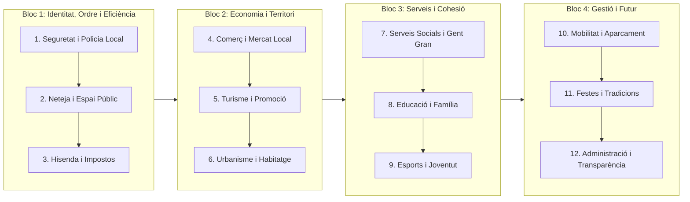

# 🗳️ PLA ESTRATÈGIC I PROTOCOL DE SECRETARIA POLÍTICA: MUNICIPALS 2027
**Candidatura Municipal d'Aliança Catalana (AC)**  
*Horitzó electoral: Quart diumenge de maig de 2027*  
*Fase actual: Preparació programàtica, consolidació d'executiva i fiscalització municipal (Setembre 2026 – Març 2027)*

---

## 1. Diagnosi de la Metodologia: De 4 Setmanes a l'Sprint Bisetmanal

### Anàlisi del teu plantejament inicial
L'enfocament de partir del **pressupost municipal real** és excel·lent i marca una diferència qualitativa respecte a l'oposició tradicional. Permet fugir de la "carta als reis" i proposar mesures rigoroses, viables i amb números clars.

Tanmateix, el model d'**1 àrea per mes (4 setmanes per àrea)** presenta tres riscos crítics:
1. **Dèficit de cobertura**: En 6 mesos (octubre a març) només treballaríeu **6 àrees**. Un ajuntament en té entre 10 i 14. Anar a eleccions sense programa en Seguretat, Neteja o Hisenda és inviable.
2. **Esgotament i dispersió**: Dedicar 4 sessions completes a un sol tema (per exemple, Turisme) crema l'equip si el tema no és transversal, i fa perdre el pols de la realitat local.
3. **Manca de contrast extern**: Si només es debat a porta tancada, es genera una visió exclusivament endogàmica.

---

### El Mètode Recomanat: Sprints Bisetmanals (Model 2+1)
Per cobrir **12 àrees municipals en 24 setmanes**, estructurarem el treball en cicles de dues setmanes per àrea, amb contrast extern:

```
[SETMANA A: Radiografia & Brainstorming] 
       │ 
       ▼ (Treball asíncron: 1 contacte amb el sector / carrer)
[SETMANA B: Priorització, Mesures Estrella & Números] 
```

| Sessió | Objectiu Principal | Metodologia de Treball | Entregable Concret |
| :--- | :--- | :--- | :--- |
| **Sessió 1 (Setmana A)** | **Radiografia i Pressupost** | Presentació de 20 min del pressupost de l'àrea (Capítol 1 personal, Capítol 2 despesa corrent, Capítol 6 inversions). Anàlisi de despesa supèrflua i deficiències. Pluja d'idees oberta. | Llista de 10-12 problemes reals i oportunitats detectades. |
| **Treball Entremig** | **Contrast amb la Realitat** | El responsable de l'àrea manté 1 o 2 converses clau amb afectats reals (un comerciant, un policia, un representant veïnal). | Validació de les queixes ciutadanes més freqüents. |
| **Sessió 2 (Setmana B)** | **Selecció i Redacció de Programa** | Debat de viabilitat. Votació ponderada de les **4-5 mesures clau** seguint els principis d'AC (ordre, eficiència, reducció d'impostos/despesa ideològica, prioritat local). | Fitxa programàtica tancada amb cost i proposta de finançament. |

---

## 2. Mapa de les 12 Àrees Municipals (Octubre 2026 – Març 2027)



- **Octubre 2026**: 1. Seguretat Ciutadana i Civisme | 2. Neteja Viària i Gestió de Residus
- **Novembre 2026**: 3. Hisenda, Taxes i Reducció de Malbaratament | 4. Comerç Local i Autònoms
- **Desembre 2026**: 5. Turisme i Hostaleria | 6. Urbanisme, Obres i Habitatge
- **Gener 2027**: 7. Família, Gent Gran i Serveis Socials | 8. Educació, Equipaments i Joventut
- **Febrer 2027**: 9. Esports i Entitats Esportives | 10. Mobilitat, Trànsit i Aparcament
- **Març 2027**: 11. Cultura, Festes i Tradicions Locals | 12. Transparència i Atenció Ciutadana

---

## 3. Estructura de la Reunió Setmanal: La Regla 50 / 25 / 25
La reunió setmanal ha de tenir una durada màxima de **90 a 120 minuts** per mantenir la concentració i l'energia de l'executiva:

```
┌────────────────────────────────────────────────────────┐
│  REUNIÓ SETMANAL DE L'EXECUTIVA LOCAL (100-120 MIN)    │
├────────────────────────────────────────────────────────┤
│ 1. PROGRAMA ELECTORAL (50-60 min)                      │
│    - Radiografia o selecció de propostes de l'àrea.   │
├────────────────────────────────────────────────────────┤
│ 2. EXECUTIVA LOCAL I COMUNICACIÓ (25-30 min)          │
│    - Rangs de xarxes (TikTok, Instagram, X).           │
│    - Gravació de vídeos de la setmana.                │
│    - Nous afiliats i trobades sectorials.              │
├────────────────────────────────────────────────────────┤
│ 3. DIA A DIA I FISCALITZACIÓ DEL PLE (25-30 min)       │
│    - Temes calents de la setmana al municipi.          │
│    - Preparació de mocions i precs per al Ple.         │
│    - Repartiment d'encàrrecs i compromisos.            │
└────────────────────────────────────────────────────────┘
```

---

## 4. Treball Intern de l'Executiva Local (Maquinària de Partit)

### A. Comunicació i Xarxes Socials
- **Vídeos Curts (TikTok / Instagram Reels / YouTube Shorts)**:
  - 2 vídeos setmanals a peu de carrer. Format: *Problema visible -> Denúncia directa -> Proposta d'AC*.
  - Menys reunions a porta tancada i més vídeos mostrant forats, brutícia, locals buits o zones insegures.
- **Pàgina de Facebook i Mitjans Locals**:
  - Facebook és crucial per al votant municipal de més de 45 anys.
  - Una nota de premsa quinzenal enviada a les ràdios i digitals de la comarca.

### B. Creixement d'Afiliats i Simpatitzants
- Establir un objectiu mensual d'altes.
- **Carpa informativa mensual**: Una parada al mercat setmanal o a la plaça major per recollir signatures, queixes ciutadanes i fitxes d'afiliació.
- Seguiment personalitzat: Tota persona que mostri interès ha de rebre una trucada del Secretari d'Organització en menys de 48 hores.

### C. Relacions amb el Partit (AC Nacional)
- Contacte regular amb la Secretaria d'Organització Nacional per alinear argumentari, material gràfic oficial i suport jurídic per a mocions.

---

## 5. El Dia a Dia i el Cicle del Ple Municipal

```
Setmana -2 (Dies 1-15): Registre de mocions pròpies i preguntes escrites.
Setmana -1 (Dijous anterior): Arribada de l'ordre del dia oficial del Ple. Anàlisi d'expedients.
Setmana 0 (Dia del Ple): Intervenció contundent, transmissió en directe i clip de vídeo resum.
Setmana +1 (Post-Ple): Balanç a les xarxes del que s'ha votat i dels incompliments de l'equip de govern.
```

---

## 6. Protocol de Secretaria: Actes Blindades i Immutabilitat
Per evitar tensions internes com ara *"això no es va aprovar així"* o modificacions posteriors:
1. **Ordre del dia previ**: El secretari envia l'ordre del dia 24 hores abans de la reunió.
2. **Gravació d'àudio**: Es registra l'àudio de la sessió.
3. **Transcripció i Esborrany**: Es genera l'acta amb els acords i tasques assignades.
4. **Període d'al·legacions**: L'executiva té 48 hores per proposar canvis sobre l'esborrany.
5. **Bloqueig i Segellat Permanent**: El Secretari clica **"Tancar i Blindar Acta"**. A partir d'aquest instant, l'acta queda en mode només lectura, bloquejada de manera immutable amb segell de temps i codi de registre oficial.
